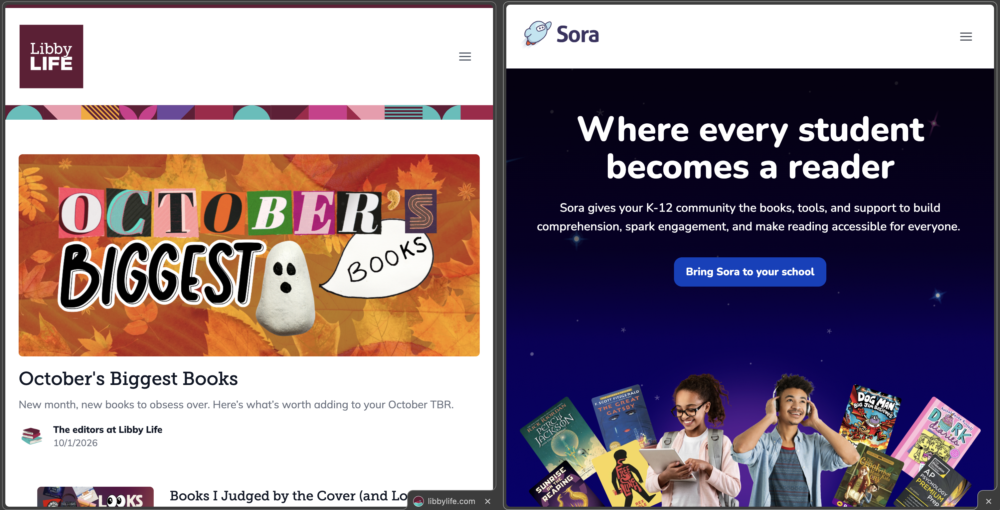
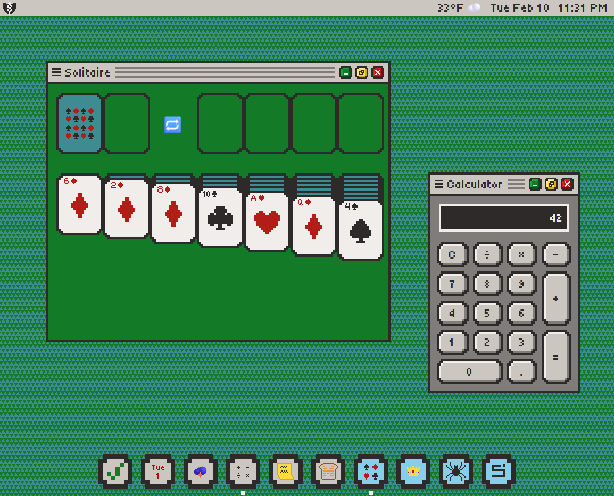

# Projects

A partial list of some of the cooler things I've done.

## Omni Design System & Marketing Platform

When I first started my current role, all of our websites were being designed
individually, each with their own themes and styles. We were dabbling in the
idea of using a headless CMS to allow author-driven site updates, but the system
was rigidly designed to the point that developer intervention was still needed
for most updates.

I certainly didn't invent the idea of a design system. But I saw a need, I
carved out some time to develop a prototype, and when
[Developer Portal redesign](https://developer.overdrive.com) came along, I took
the opportunity to build it out with branded, reusable components (even though
the design files didn't exactly call for that) and reusable content models in
our CMS.

The [Libby Life rebrand](https://www.libbylife.com) was easier, since its
designer was bought into my idea and tried to do as much as possible with
existing components. But this was still the proving ground for housing two
brands in one system and making them sufficiently unique while reusing as much
as possible.

[Discover Sora](https://www.discoversora.com) was a bit more challenging as the
designs were done for a standalone website and we already had a system in place
that it had to somewhat conform to. But despite the friction, it was still a
success. And this is where the system really proved itself, because we were able
to stand up a Discover Sora blog with almost no developer intervention based on
what we'd done for Libby Life, while at the same time Libby Life was able to
light up its Book Clubs section using the Events & Webinars feature we'd
developed for Discover Sora.

The system is really still in its infancy, and there is lots of work left to do
(surveys, composable components, more flexible content models, and more...), but
it's already proven its value in terms of user experience, brand consistency,
designer simplification, developer reduction, ease of authorship, and time to
market. I can't wait to see what else it can do.

## Sigfreed

A retro/nostalgic desktop-on-the-web, for when you just want something simple
that works. The vibes are inspired heavily by
[Picotron](https://www.lexaloffle.com/picotron.php), but the objective is pretty
much the reverse: open source but closed platform. It's all vanilla JavaScript;
there are no frameworks and no build. Check out the
[repo](https://github.com/zacksigmund/Sigfreed) and the
[site](https://zacksigmund.github.io/Sigfreed/).

## This Site

This website is pretty simple but pretty cool. Specifically:

- Know my strengths. I'm not a designer, so I'm using
  [Radix Themes](https://www.radix-ui.com) for the styles.
- Don't reinvent the wheel. Radix Themes includes a bunch of components, so I
  don't take up my own time doing what's already been done.
- Lean. I don't need advanced capabilities, so I'm able to host for free with
  [GitHub Pages](https://docs.github.com/en/pages) rather than self-host or pay
  for hosting.

[View the source code](https://github.com/zacksigmund/portefeuille).
